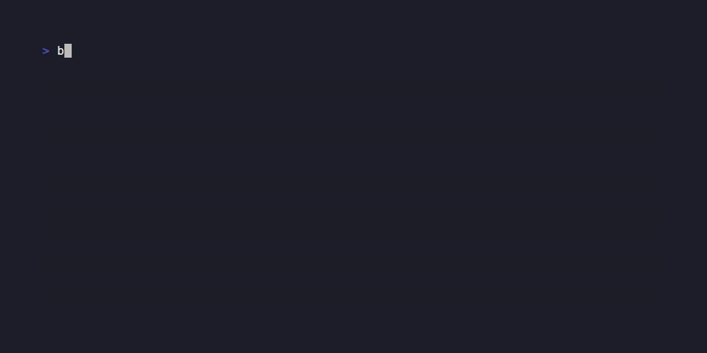

# brokkr

[](https://github.com/stanleysvk87/brokkr/actions/workflows/ci.yml)

A local, tool-augmented LLM agent that can **propose** and, after human
confirmation, **execute** shell commands inside a Docker sandbox — with
exhaustive logging so every proposed command, every approval decision, and
every execution is fully reconstructible after the fact.

Built for consumer hardware: developed and tested on a 6GB-VRAM laptop GPU,
targeting the same class of machine most homelab/local-LLM hobbyists
actually have, not a datacenter GPU. If you can run a 7B model in Ollama on
your machine, you can run brokkr.

**Why this exists**: most local-agent examples either don't actually execute
anything (they just print a suggested command and stop), or they execute
directly on your real machine with no isolation and no record of what
happened. brokkr is an attempt at the middle ground that a homelab actually
needs — a model that can act, inside a boundary that holds even when the
model is wrong, with a complete trail of what it proposed, what a human
decided, and what actually ran.

## Status

Stages 0–5 of the build are done: the sandbox mechanism, LLM proposals,
human confirmation, the policy blocklist, exact-match remembered approvals,
optional human-authored approval templates, and explicit human-curated memory
all work end-to-end and are covered by tests. Bare `brokkr` starts an interactive
mode that routes each typed line through the same pipeline as `propose`, with no
shell quoting involved. Before a model call, a local human-curated script library
can suggest a keyword-matched known-good command, but the human must explicitly
choose it every time. Named workflows can replay a
human-reviewed sequence only when the human explicitly runs it. Individual commands can opt in to
temporary network access while the sandbox remains isolated by default. Template
matching remains off by default. Manual/advisory handling covers commands that
must run outside the sandbox, `brokkr doctor` reports setup problems without
changing the system, and `brokkr history` browses the audit trail with
`--decision`/`--workflow`/`--limit` filters. The sandbox image includes reviewed tools for common JSON,
archive, Git, PDF text-extraction, and OCR tasks. See
[CHANGELOG.md](CHANGELOG.md) for exactly what was built and verified at
each stage, and [docs/architecture.md](docs/architecture.md) for how the
pieces fit together.

## What this is not

- **Not a replacement for a hardened sandbox** like gVisor or Firecracker.
  Docker here is a real, verified boundary (see
  [docs/security-model.md](docs/security-model.md)), but it shares the host
  kernel — it is not the right tool against a determined, actively
  malicious adversary with local access.
- **Not for untrusted multi-tenant use.** One user, one machine, one trust
  boundary. There is no concept of "users" in this project at all.
- **Not a fire-and-forget autonomous agent.** Every model-proposed command
  that runs was either approved by a human at the time, or matches an exact
  command or constrained template a human explicitly chose to remember.
  `brokkr sandbox exec` is a separate direct path where the human types the
  exact argv themselves. There is no mode where brokkr acts entirely on its own.
- **Not a semantic correctness verifier.** brokkr checks containment, policy,
  and execution results, but it cannot prove that output satisfies the task. A
  command can exit 0 with the wrong filter, missing sort, or no requested file
  written. Read the displayed command and output before relying on the result,
  especially when another action or decision will depend on it.

## Getting started on your own machine

brokkr is a single-user local tool, not a hosted or multi-tenant service. The
model proposes commands, but you remain responsible for reading the displayed
argv before approving it. Commands run in Docker with only the configured
workspace mounted; that workspace is real writable host storage, so an approved
bad command can still damage its contents. Network access is disabled unless
you grant it explicitly. Read [docs/security-model.md](docs/security-model.md)
before treating the sandbox as a boundary for important data.

### 1. Install the prerequisites

- Docker must be installed and running. Your user must be able to run
  `docker ps` without `sudo`.
- [Ollama](https://ollama.com) must be installed and running. Pull at least the
  default model used by this project:

  ```bash
  ollama pull qwen2.5-coder:7b
  ```

- Python 3.10 or newer must be installed with virtual-environment support.

### 2. Install brokkr

Replace `REPOSITORY_URL` with the clone URL shown by this repository's Code
button, then run:

```bash
git clone REPOSITORY_URL brokkr
cd brokkr
python3 -m venv .venv
.venv/bin/pip install -e .
cp .env.example .env
source .venv/bin/activate
```

The runtime install above is enough to use brokkr. Contributors who also need
pytest and Ruff should install `.venv/bin/pip install -e ".[dev]"`, matching
[CONTRIBUTING.md](CONTRIBUTING.md).

If Ollama listens somewhere other than `http://127.0.0.1:11434`, edit
`BROKKR_OLLAMA_URL` in `.env`. Set `BROKKR_DEFAULT_MODEL` to the exact name you
pulled if it is not `qwen2.5-coder:7b`. The other defaults are suitable for a
first local run on a typical Docker host. On a host exposing fewer than four
CPUs to Docker, lower `BROKKR_SANDBOX_CPU_LIMIT` to the available CPU count.

### 3. Verify the first run

Start with the read-only health check:

```bash
brokkr doctor
```

A fresh machine may report one warning that `brokkr-sandbox:latest` is not
built yet; there should be no failed checks. Build the image through a harmless
first sandbox command, then check again:

```bash
brokkr sandbox exec -- true
brokkr doctor
```

A fully initialized healthy setup ends with:

```text
Summary: 5 passed, 0 warnings, 0 failed
```

At that point, run `brokkr` for the interactive task prompt or continue with
the examples below. A proposal still does nothing until you explicitly approve
it, unless it exactly matches an approval or constrained template you chose to
remember earlier.

## Prerequisites

- Docker, with your user in the `docker` group (so `docker ps` works
  without `sudo`).
- [Ollama](https://ollama.com), running locally, with a model pulled that
  supports structured output (any recent instruct/coder model works —
  development used `qwen2.5-coder:7b`).
- Python 3.10+.

## Install

```bash
git clone <this repo>
cd brokkr
python3 -m venv .venv
.venv/bin/pip install -e .
cp .env.example .env   # adjust if your Ollama URL/model/paths differ
source .venv/bin/activate
```

## Quickstart

```bash
# Start interactive mode, then type one task per line without shell quoting.
# Use exit, quit, or Ctrl+D when finished.
brokkr

# Session-wide overrides use root options before any task is entered.
brokkr --model qwen3:4b --allow-network

# Check Docker, Ollama, the configured model, and workspace permissions
# without building, starting, pulling, or executing anything.
brokkr doctor

# Browse recent proposal decisions and outcomes; filters are optional.
brokkr history --limit 20
brokkr history --decision blocked
brokkr history --workflow backup-check

# Inspect the sandbox lifecycle without creating or starting a container.
brokkr sandbox status

# Run an exact command directly in the sandbox -- no LLM involved.
# Useful for exploring what the sandbox can see, and for the safety
# checks in docs/security-model.md.
brokkr sandbox exec -- ls -la /workspace

# Ask the model to propose a command for a task, in plain language.
# You'll see its reasoning and the exact command before anything runs.
brokkr propose "list every file in the workspace, including hidden ones"

# Explicitly grant outbound access to this invocation only. The model may
# report that access is needed, but only this human-typed flag enables it.
brokkr propose "check if example.com responds to curl" --allow-network

# At the confirmation prompt, choose manual for a command you need to run
# yourself. Follow the printed redirect instructions, then inspect the result
# with the short command ID brokkr printed.
brokkr propose "check disk usage of /var/log on the host"
brokkr manual show a1b2c3d4

# See exact commands and enabled human-authored templates remembered for
# auto-approval without asking again.
brokkr approvals list

# Forget a remembered command -- replace 1 with an ID from the list.
brokkr approvals revoke 1

# After approving a sequence of proposal commands, inspect and save the last
# three as one explicitly named workflow. Runs stop on the first failed step.
brokkr workflow save backup-check --steps 3
brokkr workflow show backup-check
brokkr workflow run backup-check
brokkr workflow list
brokkr workflow delete backup-check

# A later step may replace its template's single variable with the whole
# trimmed stdout of the previous step, after the template constraint validates it.
brokkr workflow save inspect-found --steps 2 --from-previous 2=tpl_abcd1234

# The first run includes tested sandbox-safe scripts. Run a known entry by name,
# or type a matching task and choose whether to use it before the model is called.
brokkr library list
brokkr library show extract-pdf-text
brokkr library run workspace-disk-usage
brokkr propose "extract readable text from the PDF document"

# Save an existing script or the last human-approved proposal explicitly.
brokkr library save list-json --description "List JSON files" \
  --command "find /workspace -type f -name '*.json' -print"
brokkr library save reviewed-check --description "Run the reviewed workspace check" \
  --from-last-approved

# Add explicit workspace context for future proposals, then inspect it.
brokkr memory add "This workspace uses Python 3.12"
brokkr memory list

# Remove a note -- replace 1 with an ID from the memory list.
brokkr memory forget 1

# Wipe the sandbox container -- next command gets a fresh rootfs.
brokkr sandbox reset
```

## Example session



The same session as text, unedited except for trimming the banner:

```
$ brokkr
brokkr interactive mode
Type a task in plain language. Type help for a reminder, or exit/quit to leave.

brokkr> how much disk space is free in the workspace
reasoning: The user wants to check how much disk space is available in the
/workspace directory.
command: df -h /workspace
Run this? [y]es / [e]dit / [n]o / [m]anual [y/e/n/m] (n): y
Filesystem             Size  Used Avail Use% Mounted on
/dev/mapper/cryptroot  476G  228G  245G  49% /workspace

-- exit 0, 37ms, command_id=bdf308258ac54703bda0966118acfb58
Remember this exact command so it skips confirmation next time? [y/n] (n): n

brokkr> exit
```

Every task goes through the same reasoning-then-command display and the same
`[y]es / [e]dit / [n]o / [m]anual` decision — no shell quoting to get right,
since a full REPL line is the task text as typed. Nothing runs without that
decision.

Every proposal, decision, and sandbox execution is recorded in `logs/audit.db`
(queryable SQLite), `logs/blobs/<command_id>/` (full raw payloads — prompts,
completions, stdout/stderr), and `logs/audit.jsonl` (a flat summary for
`tail -f`). Execution records include whether that specific command had network
access. Read-only inspection commands and changes to curated approval/memory
stores are not part of this execution audit trail.
Library executions are recorded with a distinct `library` decision and source;
library save/list/show/delete operations only change or inspect curated state.

## Configuration

All configuration is environment variables, documented with their defaults
in [.env.example](.env.example) — copy it to `.env` and adjust. Nothing in
this repository ever contains real paths, hostnames, or IPs; `.env` is
gitignored specifically so your own local configuration stays local.

## Contributing

See [CONTRIBUTING.md](CONTRIBUTING.md). Bug reports, especially anything
that looks like a sandbox escape, should go through
[SECURITY.md](SECURITY.md) instead of a public issue.

## License

Apache-2.0 — see [LICENSE](LICENSE).
